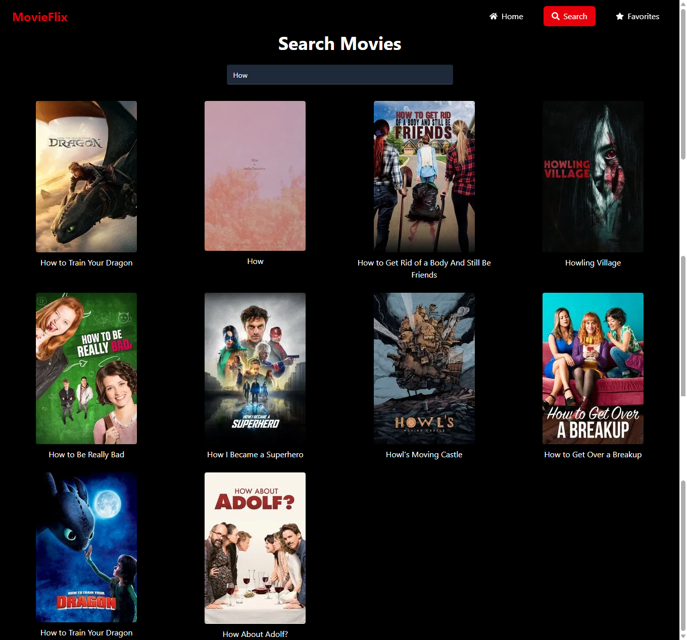
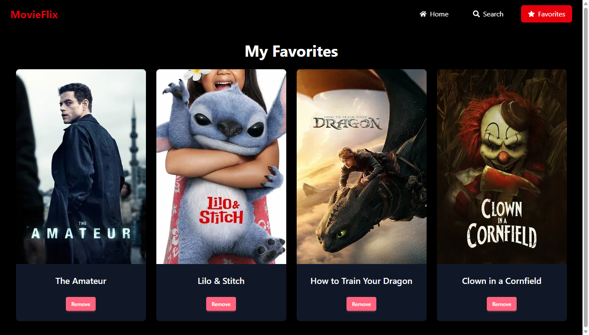
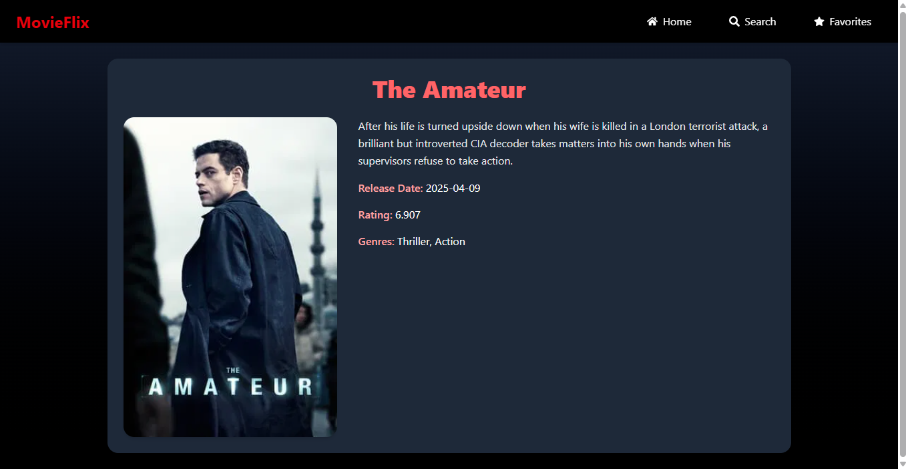

# 🎬 MovieFlix

MovieFlix is a React-based movie browser that lets users search, explore, and view details of movies using the TMDb API. Users can add movies to a favorites list (saved in localStorage) and enjoy a responsive, clean UI built with Tailwind CSS and DaisyUI.

---

## 🚀 Features

- 🔍 Live movie search  
- 🎞 View movie details  
- ❤️ Add/remove favorite movies  
- 🧭 Navigate easily with React Router  
- 🎨 Clean design with Tailwind CSS & DaisyUI  

---

## 🧰 Technologies Used

- React JS  
- DaisyUI + Tailwind CSS  
- React Router DOM  
- LocalStorage  

---

## 📦 Installation

To run the app locally:

```bash
git clone https://github.com/your-username/movieflix.git
cd movieflix
npm install
npm run dev
```
---

## 🔗 Live Demo

[👉 View Live App](https://your-deployment-link.com)

---

## 📸 Screenshots

| Home | Search | Favorites | Details |
|------|--------|-----------|---------|
|  |  |  |  |

> 🖼 Make sure these image files exist in a folder named `assets` in your repo.

---

## 🙏 Acknowledgments

- [React](https://react.dev/)
- [Tailwind CSS](https://tailwindcss.com/)
- [DaisyUI](https://daisyui.com/)
- [TMDb API](https://www.themoviedb.org/)
